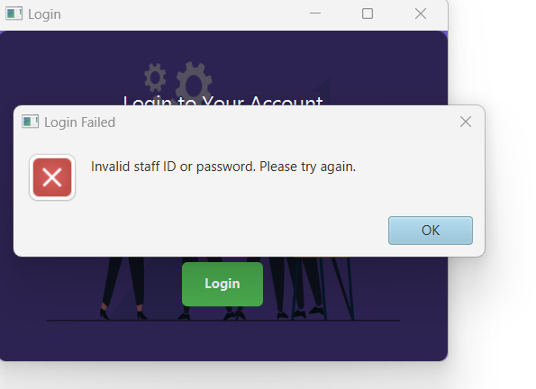

# Java Staff Workload Management System

## Overview  
This Java application helps manage staff workload allocation by recording staff details, teaching duties, and calculating total workload hours. It also supports advanced features such as data persistence, CSV import/export, login system and role based authentication.  

## Features  

- ✅ Record details of a new staff member.
- ✅ Assign duties to staff.  
- ✅ Calculate and display workload allocation for each staff member.  
- ✅ Permanent storage of data using object serialisation  
- ✅ Import workload data from a CSV file  
- ✅ Read/update workload allocation formulas from a CSV file  
- ✅ View workload details for all staff in a specific area  
- ✅ Search staff members or modules by name/ID  
- ✅ Role based user authentication (Login system) 

## Usage  
- **Add, Edit, Delete Staff:** Enter details in the form and save.
- **Add, Edit, Delete Activity Types:** Enter details in the form and save.    
- **Add, Edit, Delete Duties:** Select a staff member and input workload details.  
- **Calculating Workload:** The system automatically calculates total hours.
- **Validate total hour exceeds:** The system automatically validate and show in red colour if they exceed the expected total hours.
- **Search & Filter:** Use the search bar to find specific staff or modules.  
- **Data Persistence:** Changes are saved and loaded automatically.  

## Technology Stack  
- **Java** – Core programming language
- **JUnit** – White box testings
- **JavaFX** – User interface    
- **Object Serialisation** – Data persistence    
- **FXML** – UI layout structure 

## Class Diagram 

## WhiteBox Testings - JUnit

## BlackBox Testings - Recorded in JIRA
JIRA Project Link: 
https://sanindu.atlassian.net/jira/software/projects/ECS/list?direction=ASC&sortBy=duedate&atlOrigin=eyJpIjoiOTdlNjEyYjU1YzViNGE3OGI5ZGMxODY5ZjQyNDJmOGYiLCJwIjoiaiJ9

## WhiteBox Testings - JUnit

## Login

## Seperate Dashboards for Normal users and Admins

## Add new User

## Edit User

## Add Workload for a staff member

## Edit workload for a staf member

## Calculate total hours of staff members

## Setup and Installation  

1. **Clone the Repository**  

2. **Ensure JavaFX is Installed**  
   - Download and install [JavaFX SDK](https://gluonhq.com/products/javafx/) if not already available.  

3. **Compile and Run**  
    *run the main class using an IDE like IntelliJ IDEA or Eclipse with JavaFX support enabled.*

-
## Contributing  
Contributions are welcome! Please follow these steps:  
1. Fork the repository  
2. Create a new branch (`feature-new-functionality`)  
3. Commit changes (`git commit -m "Added new feature"`)  
4. Push to the branch and open a Pull Request  

## License  
This project is licensed under the MIT License – see the [LICENSE](LICENSE) file for details.  

---
